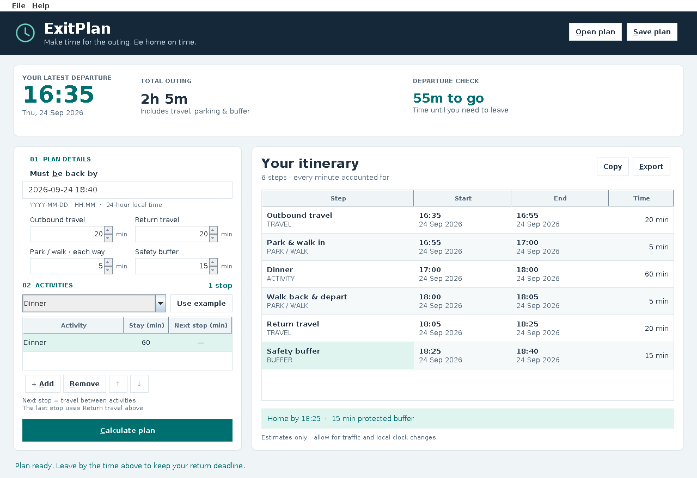

# ExitPlan

An offline Java desktop planner that works backward from the time you need to be home. Enter your activities and travel estimates, then get a complete itinerary and a clear **leave-by time**.



## Run

Install **JDK 17 or newer** (a JDK includes `javac`; a Java runtime alone does not).

**Windows:** double-click `run.bat`, or run it in a terminal. Both `java` and `javac` must be on PATH.

**macOS/Linux:** run `sh run.sh` in the project folder.

Manual commands:

```sh
mkdir -p build
javac -encoding UTF-8 -d build *.java
java -cp build ExitPlan
```

On Windows, use `mkdir build` instead of `mkdir -p build` if needed. A graphical desktop is required. No Maven, Gradle, database, or external Java dependencies are needed.

## Try it

1. Start with **Dinner**, **Dinner + movie**, or **Errands** and click **Use example**.
2. Set the return deadline in `YYYY-MM-DD HH:MM` format and adjust travel, parking/walking, and the safety buffer.
3. Double-click an activity cell (or press F2) to edit it. Add, remove, or move stops up/down.
4. Click **Calculate**. Inspect the leave-by time, departure countdown, and complete itinerary.
5. Save an editable `.exitplan` file, copy the itinerary, or export it as UTF-8 text.

## Features

- A spacious navy/teal interface with clear status, keyboard shortcuts, and resizable panels.
- Every timeline segment is shown: outbound travel, parking/walking, activities, travel between stops, return travel, and buffer.
- Input edits immediately clear stale results and disable copying/exporting them.
- Invalid edits stay visible for correction; they are not silently discarded.
- The last stop always has zero onward travel because return travel is a separate setting. Reordering can clear that value: review the travel estimates afterward.
- Save/load with version checks, bounded file reads, shared validation, and temporary-file replacement.
- Past departure times produce a warning. Overnight plans retain their full dates.

## How the code fits together

| File | Responsibility |
|---|---|
| `ExitPlan.java` | Swing layout, user actions, validation feedback, countdown |
| `ActivityTableModel.java` | Editable stop list and reordering |
| `PlanCalculator.java` | Pure validation and backward calculation; immutable timeline |
| `PlanData.java` | Validated input snapshot |
| `PlanFiles.java` | Versioned Properties save/load and text export |
| `ItineraryFormatter.java` | Shared clipboard/export text |

The calculator is independent of the window, so its behavior can be tested without clicking through the app.

## Tests

```sh
javac -encoding UTF-8 -Xlint:all -d build *.java
java -cp build PlanCalculatorTest
java -cp build PlanTimelineTest
java -cp build PlanFilesTest
java -cp build ActivityTableModelTest
java -cp build ExitPlanGuiTest
```

The GUI suite requires a display; Linux CI runs it with `xvfb-run -a`. The suites cover invalid values, overnight plans, complete timeline segments, malformed files, save/load, editing, reordering, stale-result handling, clipboard output, and minimum-size layout.

## Scope

Travel times are your estimates; there is no routing, traffic service, notification scheduler, or calendar integration. Calculations use local wall-clock dates/times, not timezone-aware elapsed time. Check plans that cross daylight-saving changes or time zones. The countdown is advisory and runs only while the app is open.
